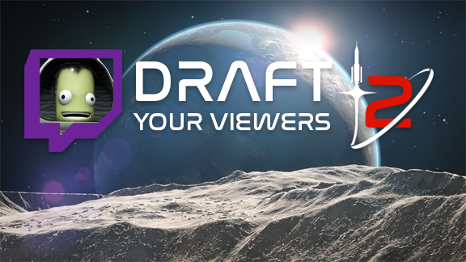

# Draft Your Viewers 2
## By Nifty255

https://github.com/Nifty255/DraftYourViewers2 - Licensed under GPLv3

Don't want to strand Jeb in space? Strand your viewers instead!

Draft Your Viewers 2 is a mod for Kerbal Space Program 2. By authorizing the mod, it can get a list of viewers in your chat, and draft them into your Space Program any time you need them.

## Features:
- Draft a viewer as a Kerbal into your Roster
- Draw a random viewer without drafting them
- Block certain accounts by username or display name

## Coming Soon:
- Draft a viewer directly into your active craft
- Customizable sounds
- Support for KSP 2's built-in mod loader (when it's finished)

## How to Install:
1. Download BepInEx for KSP, [available on Space Dock](https://spacedock.info/mod/3255/BepInEx%20for%20KSP%202).
2. Follow BepInEx's install instructions. Luckily, it's pretty EZ!
3. Download a release. Make sure you get one for your KSP 2 version.
4. Copy the contents of the zip file into `<KSP Folder>/BepInEx/plugins`

## Dev Requirements:
- [Unity 2020.3.33f1](https://unity.com/releases/editor/whats-new/2020.3.33)
- [Visual Studio 2019](https://visualstudio.microsoft.com/vs/older-downloads/) or later

## How to Code:
1. Open any script in `Assets/Scripts` OR open `Draft Your Viewers 2.sln`. The first C# project is the Unity project, for exporting Asset Bundles. The second is a class library for building the mod DLL.
2. To build a Unity version of the DLL, set the Solution Configuration to `Debug`. This will cause the build process to use only mock Unity code.
3. Copy the built DLL from `bin/Debug/net46` into the `Assets/ModLib` folder. You can now use everything that doesn't directly reference KSP 2 code, including a few dummy test replacements.
4. Whenever you're ready to test inside KSP 2, switch the Solution Configuration to Release and then build. Copy the DLL from `bin/Release/net46` into your KSP 2 install's BepInEx plugins folder.

## How to Bundle Assets:
1. Pick one or more assets, or a folder of them. In the Project view, start in the parent folder of what you want to bundle.
2. Select the item(s) (careful not to enter if it's a folder). Look at the bottom of the Inspector view for an "Asset Labels" section. Use this to create labels for Asset Bundles.
3. When you've organized your assets into different bundles/labels, go to `Assets -> BuildAssetBundles` in the top menu. Your Asset Bundles will be at `repo/AssetBundles`.